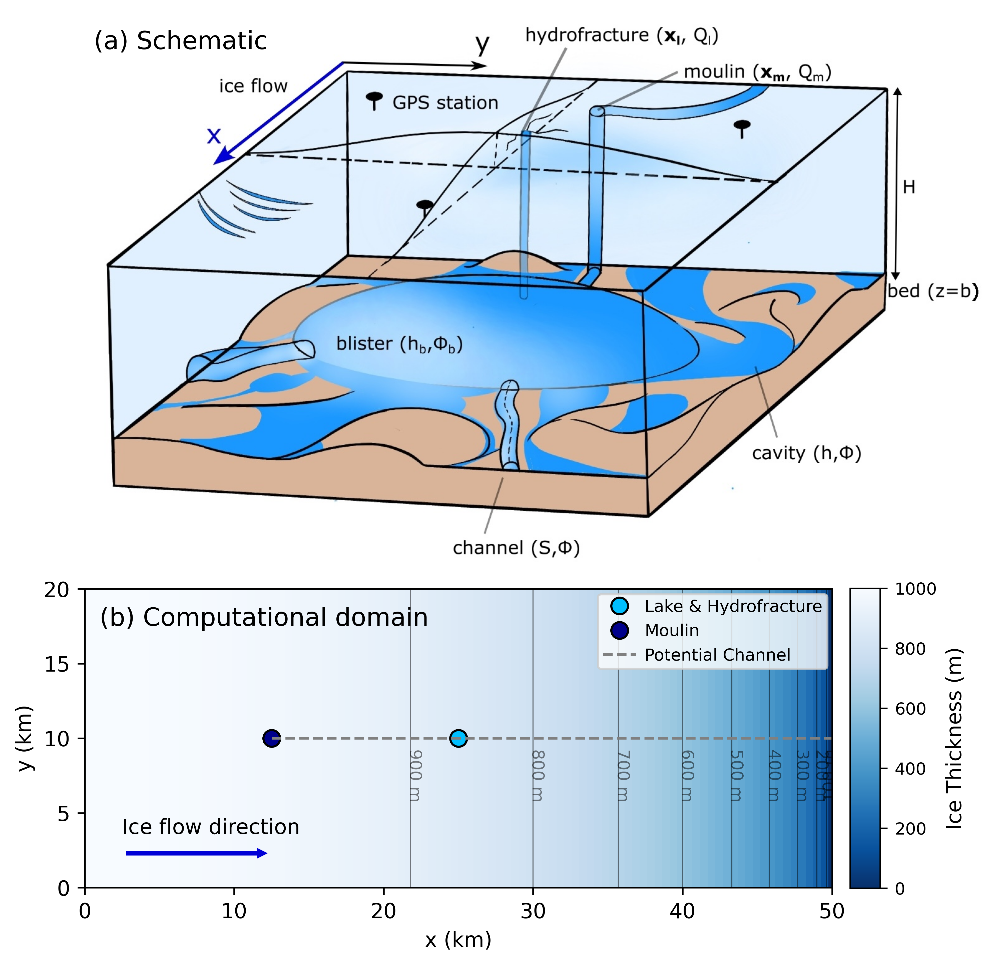

The repository contains the MATLAB/Python code for simulating the subglacial hydrology with blisters followed by rapid supraglacial lake drainage events.

<p align="center">
  
</p>

# Contents
The repository contains the essential files for running the model and visualising the results. The directory structure is as follows:
```.
├── README.md
├── figures (figures in the manuscript)
├── results
│   └── {casename}
├── src (essential source files)
├── srcgen (Python scripts to generate matlab scripts to do parameter sweep)
└── srcplot (Python/MATLAB scripts for visualisation)
└── generated_scripts (MATLAB scripts that can be run directly)
```

# How to run
1. Clone the repository to your local machine.
2. Genrate the matlab scripts for a given parameter combination using the Python scripts in the `srcgen` folder. You can modify the parameters in the scripts as needed. The generated scripts will be saved in the `generated_scripts` folder. In general, they can be categorised into three types:
    - Reference scripts (`reference_scripts.ipynb`): Scripts that run the idealised cases in a rectangular domain without basal heterogeneity.
    - Regional scripts (`regional_study_scripts.ipynb`): Scripts that run the cases in a regional domain with bed topography.
    - Convergence test scripts (`convergence_test_scripts.ipynb`): Scripts that run the convergence tests for spatial resolution.
Note that all cases consist of two stages: spinup and drainage. The spinup stage brings the system to a quasi-steady state, which is then used as the initial condition for the drainage stage.

3. The bash script `nevis_run.sh` can be modified to run the generated matlab scripts. Otherwise, you can run the matlab scripts directly in MATLAB. It moves the generated scripts to the current folder and runs them one by one, saving the results in the `results/{casename}` folder. The script automatically handles the spinup and drainage stages by prioritising the spinup scripts.

4. Use the scripts in the `srcplot` folder to visualise the results. You can modify the scripts as needed.

5. Detailed implementation of the model is in `src` folder.