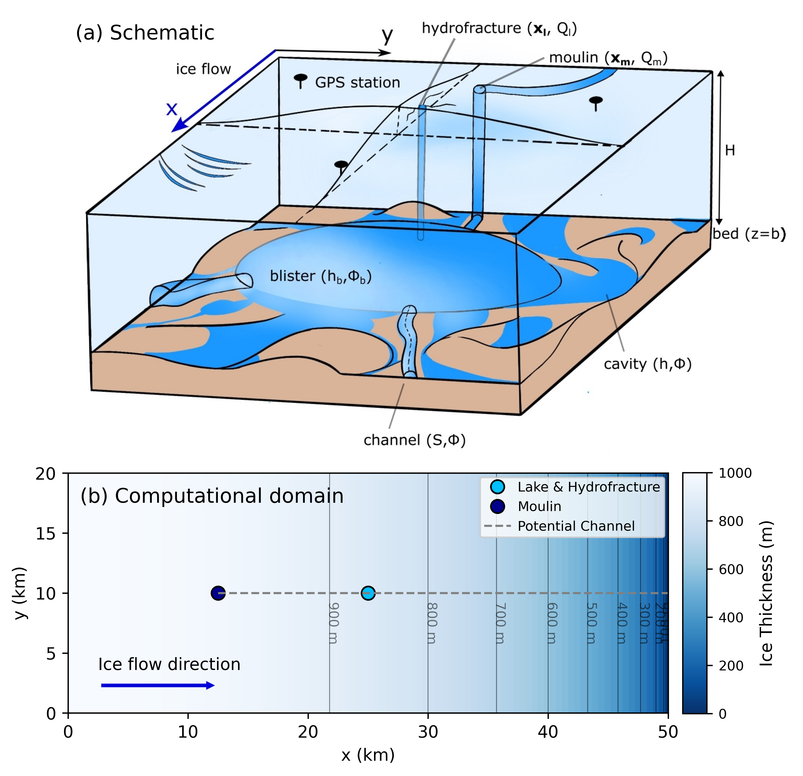

# NEVIS: A model for subglacial hydrology with blisters

The repository contains the MATLAB/Python code for simulating the subglacial hydrological system that incorporates the effects of supraglacial lake drainage and suglacial blisters. The model is described in [Zhang et al. (2025)](). The model builds upon the subglacial hydrology model of [Hewitt (2013)](https://doi.org/10.1016/j.epsl.2013.04.022), extending it to include the formation and evolution of subglacial blisters caused by supraglacial lake drainage events.

The schematic of the model setup is shown below
<p align="center">
  
</p>

# Contents
The repository contains the essential files for running the model and visualising the results. The directory structure is as follows:
```
.
├── README.md
├── figures/                   # Figures in the manuscript
├── results/
│   └── {casename}/            # Simulation results for each case
├── src/                       # Essential source files
├── srcgen/                    # Python scripts to generate MATLAB scripts for parameter sweep
├── srcplot/                   # Python/MATLAB scripts for visualisation
├── generated_scripts/         # MATLAB scripts that can be run directly
├── inversion                  # inversion scripts to calculate background C
├── webpage                    # A draft webpage to visualise the results
```

# How to run
1. Clone the repository to your local machine.
2. Generate the matlab scripts for a given parameter combination using the Python scripts in the `./srcgen` folder. Note that you need to move the `*.ipynb` scripts from `./srcgen` to `./` before running them. You can modify the parameters in the scripts as needed. The generated scripts will be saved in the `./generated_scripts` folder. In general, they can be categorised into three types:
    - Reference scripts (generated by `reference_scripts.ipynb`): Scripts that run the idealised cases in a rectangular domain without basal heterogeneity.
    - Regional scripts (generated by `regional_study_scripts.ipynb`): Scripts that run the cases in a regional domain with bed topography.
    - Convergence test scripts (generated by `convergence_test_scripts.ipynb`): Scripts that run the convergence tests for spatial resolution.
Note that all cases consist of two stages: spinup and drainage. The spinup stage brings the system to a quasi-steady state, which is then used as the initial condition for the drainage stage.

3. The bash script `nevis_run.sh` can be modified to run the generated matlab scripts. It moves the generated scripts to the main folder `./` and runs them one by one, saving the results in the `./results/{casename}` folder. The script automatically handles the spinup and drainage stages by prioritising the spinup scripts. Otherwise, you can run the matlab scripts directly in MATLAB after moving them to `./`.

4. Use the scripts in the `./srcplot` folder to visualise the results. You can modify the scripts as needed. Note that you need to move the scripts to `./` before running them. The visualisation scripts can generate plots and animations similar to those in the manuscript:
    - `schematic.ipynb`: Generate the schematic figure (Figure 1).
    - `make_plot.ipynb`: Generate static plots like Figures 2-7.
    - `convergence_test.ipynb`: Generate convergence test plots (Figure B1, B2).
    - `animation.ipynb`: Generate animations in the supplementary material.

5. Detailed implementation of the model is in `./src` folder. Users can refer to the attached documentation `./docs/nevis.pdf` for more information about the model.

# Ice-dynamics extension
The repository now also includes an ice-dynamics extension that couples the hydrology/blister model to a depth-averaged shallow-shelf-style ice velocity solver. The main solver is `./src/nevis_velocity.m`, with supporting routines for stress calculation, ice boundary labelling, surface motion, and coupled time stepping:
```
./src/nevis_velocity.m                 # SSA-style ice velocity solve
./src/nevis_stresses.m                 # membrane, basal, and driving stress diagnostics
./src/nevis_principal_stress.m         # principal stress magnitudes and directions
./src/nevis_update_parameters_ice.m    # ice-dynamics parameter setup
./src/nevis_label_ice.m                # ice velocity boundary labels
./src/nevis_label_ice_test.m           # regional/test boundary labels
./src/nevis_timesteps_ice.m            # coupled hydrology/blister/ice time stepping
./src/nevis_export_ice_fields.m        # export fields used by animation scripts
```

The ice-dynamics examples and templates live in `./models`. The main regional templates are:
```
./models/n2d_region_ice_template.m
./models/n2d_region_ice_drainage_template.m
```

These scripts set up the regional Morlighem/MEaSUREs geometry and velocity data, initialise the hydrology and blister fields, solve for ice velocity, and then run either spinup or drainage simulations. Parameter-sweep scripts for this workflow can be generated from:
```
./srcgen/ice_dynamics_scripts.ipynb
```

Generated ice-dynamics scripts are placed under:
```
./generated_scripts/ice_dynamics/
```

Typical workflow:
1. Prepare or update the regional data files in `./data/nevis_regional/`.
2. Generate spinup and drainage scripts with `./srcgen/ice_dynamics_scripts.ipynb`, or start from the templates in `./models`.
3. Run the spinup case first; its final state is used as the initial condition for drainage cases.
4. Run the drainage case, which can include prescribed lake drainage, distributed surface runoff, GPS extraction points, and coupled changes in effective pressure and sliding.
5. Use the Python/MATLAB plotting tools in `./srcplot` and `./analysis` for stress, GPS, velocity, and animation diagnostics.

# Inversion workflow
The repository also includes adjoint-based inversion scripts for estimating the spatial basal friction/slipperiness field from observed surface velocity. These scripts are kept in:
```
./inversion/
```

The main entry points are:
```
./inversion/nevis_inv_C.m              # C-field inversion using observed MEaSUREs velocity
./inversion/nevis_inv_C1.m             # alternate C-field inversion setup
./inversion/nevis_inv_runoff_30_C2.m   # runoff/C2-related inversion experiment
./inversion/nevis_inv_partition.m      # partition inverted friction into coupled/uncoupled components
```
By default, we suggest to use `nevis_inv_C.m` for the main inversion workflow, which is designed to be work for the Weertman type sliding law `tau_b = C * u_b^m`. The inverted field `C(x,y)` corresponds to a time-independent basal friction that can be furture partitioned into pressure-sensitive and pressure-insensitive components for coupled forward simulations by `nevis_inv_partition.m`.

The inversion solves for the control variable `c = log(C)` on model nodes. It compares modelled and observed velocity, applies spatial regularisation and damping, and can optionally run finite-difference/Taylor checks of the adjoint gradient. The inverted field can then be used by the ice-dynamics spinup and drainage scripts through files such as:
```
./data/C_inversion_results.mat
./data/velocity_inverted.mat
```

Typical workflow:
1. Run or load a regional spinup state used to initialise the inversion grid and hydrology variables.
2. Load observed MEaSUREs velocity from `./data/nevis_regional/`.
3. Run `./inversion/nevis_inv_C.m` to invert for `C(x,y)`.
4. Save the resulting friction field and diagnostic variables to `./data/`.
5. Use `nevis_inv_partition` or the ice-dynamics templates to partition the inverted field into pressure-sensitive and pressure-insensitive sliding components for coupled forward simulations.

For mathematical details of the inversion formulation and gradient checks, see:
```
./docs/nevis_inversion.tex
```

# License
This repository is licensed under the CC BY-NC 4.0 License. See the [LICENSE](./LICENSE) file for more information.

# References
Please cite the following paper when using this code.

Stevens, L. A. (2026). Ice-sheet hydro-fracture not advanced inland by lower-elevation lake drainages in Kalaallit Nunaat (v1.0.0). Zenodo. [doi.org/10.5281/zenodo.19387821](https://doi.org/10.5281/zenodo.19387821)

Zhang, H., Stevens, L. A., Hewitt, I. J., & Stuart, H. (in prep). A unified blister and subglacial hydrology
framework for supraglacial lake drainage events. Journal of Geophysical Research: Earth Surface.

Hewitt, I. J. (2013, June). Seasonal changes in ice sheet motion due to melt water lubrication. Earth and Planetary Science Letters, 371–372 , 16–25. [doi: 10.1016/j.epsl.2013.04.022](https://doi.org/10.1016/j.epsl.2013.04.022)

Stevens, L. A., Hewitt, I. J., Das, S. B., & Behn, M. D. (2018, September). Relationship Between Greenland Ice Sheet Surface Speed and Modeled Effective Pressure. Journal of Geophysical Research: Earth Surface, 123 (9), 2258–2278. [doi: 10.1029/2017JF004581](https://doi.org/10.1029/2017JF004581)
